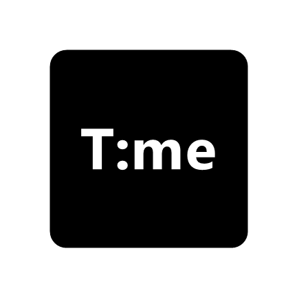

<p align="center">
  
</p>

<h1 align="center">屏幕时钟（Android）</h1>

<p align="center">
  <a href="LICENSE"></a>
</p>

一个可横屏或竖屏使用的全屏时钟。支持 12/24 小时制、秒数开关、时区切换，以及公历日期和中国农历显示。可使用本地图片、GIF / 动态 WebP、视频或播放列表作为背景，并调节背景、文字和侧栏的外观。

本项目的创意来源于作者曾经用过的一款时钟 App，在此致谢。项目从零重写，独立实现全部功能。

本项目由作者主导开发，Codex 和 DeepSeek 参与了设计与制作。

## 功能

- 全屏时钟：默认 12 小时制并显示 AM/PM，可独立隐藏 AM/PM 或切换 24 小时制；可显示秒数、公历与农历日期
- 时区搜索与切换：按 UTC 偏移、城市、时区 ID 或本地名称检索，独立显示时区文字
- 背景：本地图片、GIF / 动态 WebP、视频，亮度与位置调节
- 播放列表：批量添加、排序、随机 / 顺序、循环、图片停留时间及画面交叠过渡
- 字体：多字体导入管理，50%–200% 大小调节，颜色调节，整组文字位置预览与拖动
- 界面：侧栏透明度、动态按钮颜色（Monet）、文字阴影与加粗、中英文语言
- 省电：关闭秒数后按分钟刷新；静态背景按屏幕采样解码，动图保留动画

## 运行

用 Android Studio 打开本文件夹，在 Android 9（API 28）及以上设备或模拟器运行 `app`。项目使用 Android Gradle Plugin 8.13.2 与 Gradle 8.13，无需网络权限。

## 构建

安装 Android SDK 与 JDK 17 后，在项目根目录运行 `./gradlew assembleDebug`（Windows PowerShell 使用 `.\gradlew.bat assembleDebug`）。也可以用 Android Studio 打开项目并运行 `app`。

## 目录

```text
app/src/main/java/com/example/timedisplay/
  MainActivity.java       时钟页面、双侧抽屉、背景显示、生命周期
  ClockFaceView.java      时间、公历和农历绘制
  SettingsPanel.java      左侧设置与右侧自定义、文件导入
  ClockSettings.java      设置键
  FontLibrary.java        字体文件副本、名称读取、选择与删除
  UiPalette.java          动态按钮颜色与旧系统回退色
  BackgroundImageView.java 图片与动图平铺绘制
  L10n.java               应用语言选择与中英文文案
  PlaylistStore.java      背景播放列表文件和顺序管理
  PlaylistFolderImporter.java 文件夹扫描与媒体导入
```
